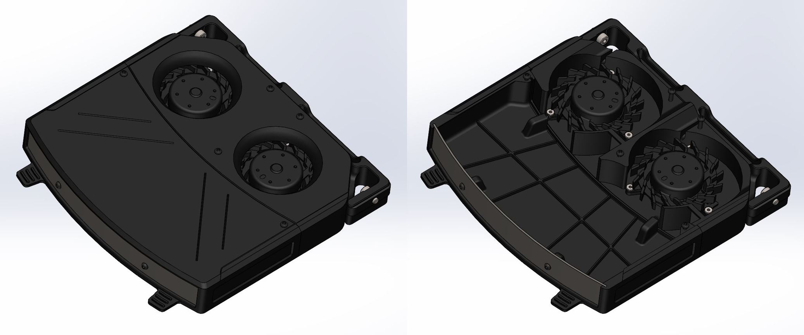
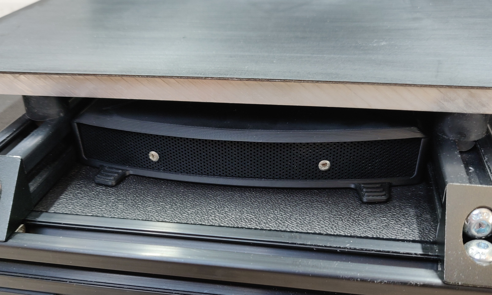

## Rebreather 

## What is it?
Rebreather is a tiny air recirculation filter that can fit inside your 3D printer's chamber. It uses activated carbon pellets to capture VOC particles. Rebreather is heavily inspired by the work of 0ndsk4 and the Nevermore Micro. Its improvements lie in the dual blower design that makes it more powerful and compact. The blowers are OTS components with proper PWM and Tachometer support, and do not require any glue to mount. They also have polarity and locked rotor protection. The cartridge has been extended to increase the absorbtion capacity. With a printed mesh, it's hard to get good layerstacking, so a mesh material is used, similar to what one would find in a computer case. The filter is still in beta - feedback is welcome. 

Print in ABS or ABS+

## Hardware needed:
- 8x M2x4 
- 9x M3x8 (self tapping)
- 8x 6x3mm magnet
- 2x Delta KFB04512HHAF0C
- 30x3cm computer mesh*
- 1x M3x5x4 heatinsert

The total price excluding carbon pellets is around 25 euro. A sourcing guide can be found on Discord.
*Cutting along the 'grain' results in a straight cut. A sample strip stl is included to help.

## Sourcing
A BOM can be found here: [The ANNEX Sourcing Guide](https://docs.google.com/spreadsheets/d/1O3eyVuQ6M4F03MJSDs4Z71_XyNjXL5HFTZr1jsaAtRc/edit?usp=sharing)

## Maintenance
It is recommended to replace the contents of the cartridge every 100 hours, or approximately 2 months.

## Future plans
Once the Delta KFB0612HAFDB comes back in stock, it can be a good substitute candidate thats even more powerful. An integrated dust filter may also be explored.

## Resources
Thank you to the Nevermore micro, without this, this design would have not come into fruition: https://github.com/nevermore3d/Nevermore_Micro
 

## Discord
Do you have any design suggestions or ideas? We would love to hear! You can join us at https://discord.gg/MzTR3zE

