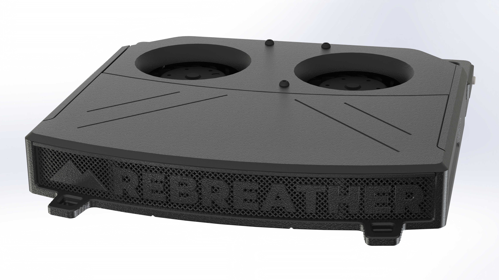

## Rebreather 

## What is it?
Rebreather is a tiny air recirculation filter that can fit inside your 3D printer's chamber. It uses activated carbon pellets to capture VOC particles. Rebreather is heavily inspired by the work of 0ndsk4 and the [Nevermore Micro](https://github.com/nevermore3d/Nevermore_Micro). Its improvements lie in the dual blower design that makes it more powerful and compact. The blowers are OTS components with proper PWM and Tachometer support, and do not require any glue to mount. These high quality fans have polarity and locked rotor protection. The cartridge has been extended to increase the absorbtion capacity. Other features of the cartridge are the self locking lid and the FDM optimized mesh.

Print in ABS or ABS+

## Hardware needed:
- 6x M2x4
- 11x DIN912 M2x8 (self tapping)
- 8x 6x3mm magnets
- 2x Delta KFB04512HHAF0C
- 1x M3x5x4 heatinsert (5 if you use the bottem mounting holes)

The total price excluding carbon pellets is around 25 euro. When sourcing the pellets its strongly recommended to use courser pellets which are washed acid-free.

## Sourcing
A BOM can be found here: [The ANNEX Sourcing Guide](https://docs.google.com/spreadsheets/d/1O3eyVuQ6M4F03MJSDs4Z71_XyNjXL5HFTZr1jsaAtRc/edit?usp=sharing)

## Maintenance
It is recommended to replace the contents of the cartridge every 100 hours, or approximately 2 months.

## Future plans
With the new printed mesh we are still seeking for the best grid dimensions to allow the best airflow permeability. Once the Delta KFB0612HAFDB comes back in stock, it can be a good substitute candidate thats even more powerful*.

*Discord user Kirby already made the mod: https://github.com/Annex-Engineering/Annex-Engineering_User_Mods/tree/main/Misc/Rebreather/Kirby-RebreatherXL

## Resources
Thank you to the Nevermore micro, without this, this design would have not come into fruition: https://github.com/nevermore3d/Nevermore_Micro
 
## Discord
Do you have any design suggestions or ideas? We would love to hear! You can join us at https://discord.gg/MzTR3zE

